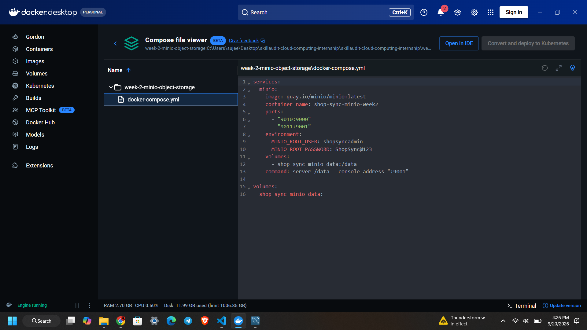
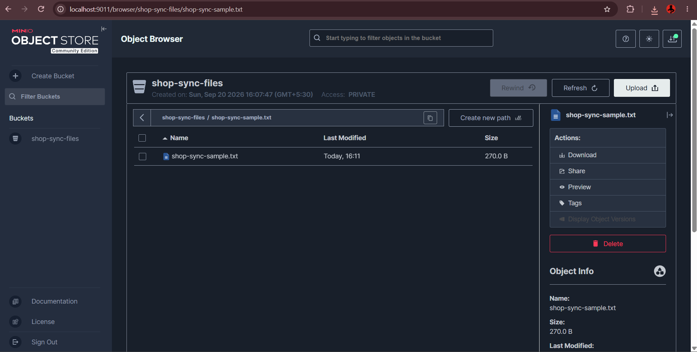
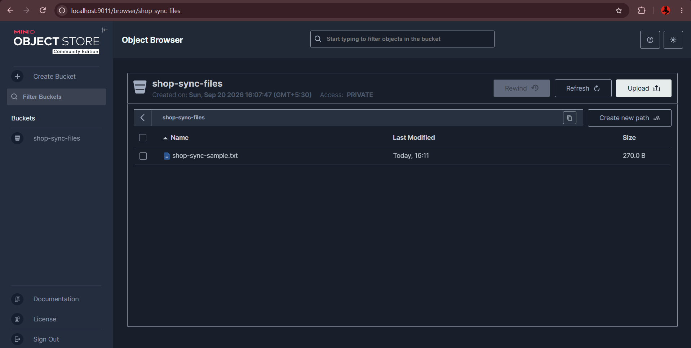
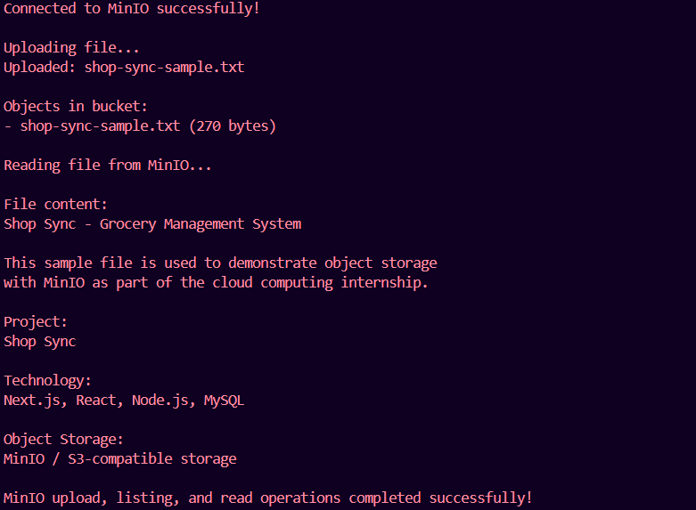

# Week 2 – MinIO Object Storage

## Objective

The objective of Week 2 is to simulate cloud-based object storage using **MinIO** and perform basic object storage operations such as creating a bucket, uploading files, listing objects, and reading files using Python.

This task is implemented as part of the **Shop Sync – Grocery Management System** cloud computing internship.

---

## Project

### Shop Sync – Grocery Management System

Shop Sync is a grocery management system developed using:

- Next.js
- React
- Node.js
- MySQL

For this task, **MinIO** is used as an **S3-compatible object storage service**.

---

## Technologies Used

- Docker Desktop
- Docker Compose
- MinIO
- Python
- Boto3
- S3-compatible object storage

---

## Folder Structure

```text
week-2-minio-object-storage/
│
├── README.md
├── docker-compose.yml
├── minio_script.py
│
├── sample/
│   └── shop-sync-sample.txt
│
└── screenshots/
    ├── 01-docker-container.png
    ├── 02-file-upload.png
    ├── 03-minio-container.png
    └── 04-python-minio-output.png
```

---

## 1. Running MinIO Using Docker

MinIO was deployed locally using **Docker Compose**.

The MinIO container was configured with:

- **MinIO API Port:** `9010`
- **MinIO Console Port:** `9011`
- **Container Name:** `shop-sync-minio-week2`
- **Storage Volume:** `shop_sync_minio_data`

The Docker Compose configuration is available in:

```text
docker-compose.yml
```

### Docker Compose Configuration

```yaml
services:
  minio:
    image: quay.io/minio/minio:latest
    container_name: shop-sync-minio-week2
    ports:
      - "9010:9000"
      - "9011:9001"
    environment:
      MINIO_ROOT_USER: shopsyncadmin
      MINIO_ROOT_PASSWORD: ShopSync@123
    volumes:
      - shop_sync_minio_data:/data
    command: server /data --console-address ":9001"

volumes:
  shop_sync_minio_data:
```

The MinIO service was started using:

```bash
docker compose up -d
```

### Docker Configuration



---

## 2. MinIO Web Console

The MinIO web console was accessed using:

```text
http://localhost:9011
```

A separate bucket was created for the Shop Sync project.

### Bucket Name

```text
shop-sync-files
```

The bucket was configured as a **private bucket**.

---

## 3. Uploading a Sample File

A sample text file was created at:

```text
sample/shop-sync-sample.txt
```

The file contains basic information about the Shop Sync project.

The file was uploaded to the `shop-sync-files` bucket using the MinIO web console.

### Uploaded Object

```text
shop-sync-sample.txt
```

### File Size

```text
270 bytes
```

### File Upload



### MinIO Bucket



---

## 4. Python Integration Using Boto3

Python was integrated with MinIO using the **Boto3** library.

The Python script is available as:

```text
minio_script.py
```

The script performs the following operations:

1. Connects to MinIO
2. Uploads the sample file
3. Lists objects in the bucket
4. Reads the uploaded file
5. Displays the file contents

---

## 5. Running the Python Script

Make sure the MinIO container is running before executing the Python script.

Run:

```bash
python minio_script.py
```

The script successfully performed the following workflow:

```text
Upload
   ↓
List Objects
   ↓
Read Object
```

### Python Output



The output confirms:

```text
Connected to MinIO successfully!

Uploading file...
Uploaded: shop-sync-sample.txt

Objects in bucket:
- shop-sync-sample.txt (270 bytes)

Reading file from MinIO...

File content:
Shop Sync - Grocery Management System
```

The final message confirms that all operations were completed successfully.

---

## 6. Sample File Content

The uploaded object contains:

```text
Shop Sync - Grocery Management System

This sample file is used to demonstrate object storage
with MinIO as part of the cloud computing internship.

Project:
Shop Sync

Technology:
Next.js, React, Node.js, MySQL

Object Storage:
MinIO / S3-compatible storage
```

---

## 7. Operations Demonstrated

| Operation | Status |
|---|---|
| Run MinIO using Docker | Completed |
| Create object storage bucket | Completed |
| Upload file | Completed |
| List objects | Completed |
| Read object | Completed |
| Python Boto3 integration | Completed |

---

## 8. Learning Outcome

Through this task, I learned how to:

- Deploy MinIO using Docker Compose.
- Create and manage an object storage bucket.
- Upload files to S3-compatible storage.
- List objects stored in a bucket.
- Retrieve and read stored files.
- Connect Python applications to MinIO using Boto3.
- Understand the basic workflow of cloud object storage.

---

## Conclusion

Week 2 successfully demonstrates the use of **MinIO as an S3-compatible object storage service** for the Shop Sync Grocery Management System.

The implementation covers Docker-based deployment, bucket creation, file upload, object listing, and file retrieval using Python and Boto3.