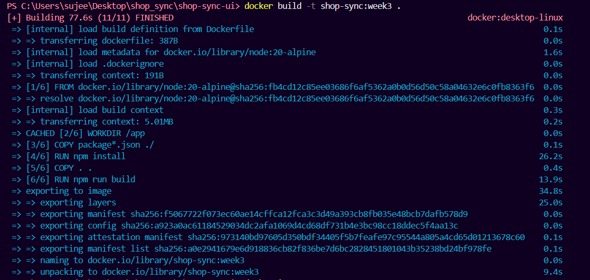
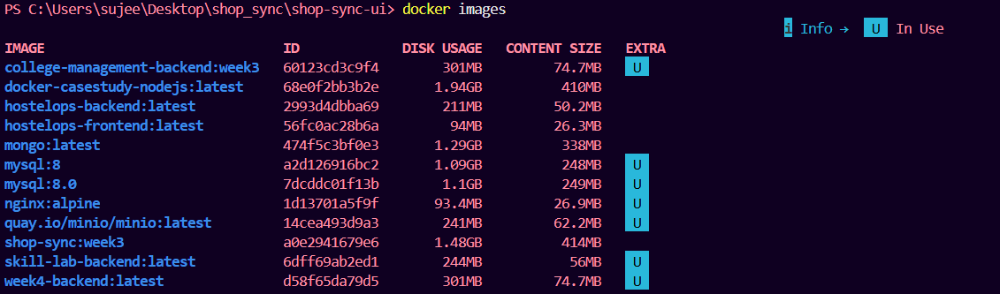
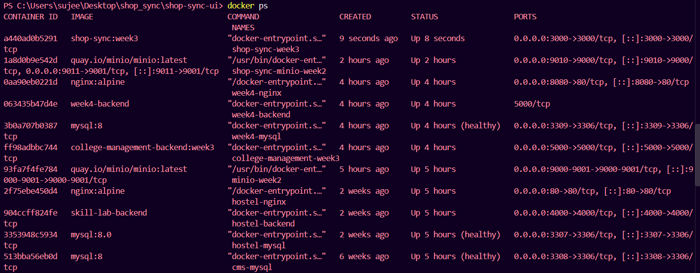
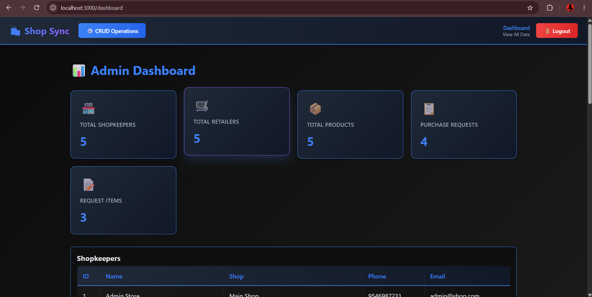

# Week 3 – Dockerise Shop Sync

## Objective

The objective of Week 3 is to containerize the **Shop Sync – Grocery Management System** application using Docker.

The application was packaged into a Docker image and run as a Docker container. The containerized application was then connected to the MySQL database and accessed through a web browser.

---

## Project

### Shop Sync – Grocery Management System

Shop Sync is a grocery management system developed using:

- Next.js
- React
- Node.js
- MySQL

For this task, Docker was used to package and run the Next.js application in an isolated container environment.

---

## Technologies Used

- Docker Desktop
- Docker
- Node.js 20 Alpine
- Next.js 16.0.4
- React
- MySQL
- PowerShell

---

## Folder Structure

```text
week-3-dockerise-shop-sync/
│
├── README.md
├── Dockerfile
├── .dockerignore
│
└── screenshots/
    ├── 01-docker-build.png
    ├── 02-docker-image.png
    ├── 03-docker-container.png
    └── 04-shop-sync-docker.png
```

---

## 1. Application Build Verification

Before creating the Docker image, the Shop Sync application was tested using the Next.js production build command.

```bash
npm.cmd run build
```

The production build completed successfully with the Next.js application compiling and generating the required pages and API routes.

---

## 2. Dockerfile

A Dockerfile was created to containerize the Shop Sync application.

The Dockerfile uses **Node.js 20 Alpine** as the base image.

### Dockerfile

```dockerfile
# Use Node.js 20
FROM node:20-alpine

# Set working directory
WORKDIR /app

# Copy package files
COPY package*.json ./

# Install dependencies
RUN npm install

# Copy application source
COPY . .

# Build the Next.js application
RUN npm run build

# Expose Next.js port
EXPOSE 3000

# Start the application
CMD ["npm", "start"]
```

---

## 3. Docker Ignore File

A `.dockerignore` file was created to prevent unnecessary files from being copied into the Docker image.

```text
node_modules
.next
.git
.gitignore
Dockerfile
docker-compose.yml
npm-debug.log*
.env
.env.local
.env.development
.env.production
README.md
```

---

## 4. Building the Docker Image

The Docker image was created using:

```bash
docker build -t shop-sync:week3 .
```

The Docker build completed successfully.

The image was created with the name:

```text
shop-sync:week3
```

### Docker Build



---

## 5. Docker Image Verification

The created Docker image was verified using:

```bash
docker images
```

The `shop-sync:week3` image was successfully listed.

### Docker Image



---

## 6. Running the Docker Container

The Shop Sync application was started as a Docker container using:

```bash
docker run -d --name shop-sync-week3 -p 3000:3000 --env-file .env.local -e DB_HOST=host.docker.internal shop-sync:week3
```

The container was named:

```text
shop-sync-week3
```

The application port was mapped as:

```text
3000:3000
```

The `DB_HOST` environment variable was set to:

```text
host.docker.internal
```

This allows the application running inside the Docker container to access the MySQL database running on the host machine.

---

## 7. Docker Container Verification

The running container was verified using:

```bash
docker ps
```

The output showed:

```text
shop-sync-week3
shop-sync:week3
0.0.0.0:3000->3000/tcp
```

### Running Container



---

## 8. Accessing the Containerized Application

The Dockerized Shop Sync application was accessed through:

```text
http://localhost:3000
```

The dashboard was successfully loaded at:

```text
http://localhost:3000/dashboard
```

The application successfully connected to the MySQL database and displayed database records.

The dashboard displayed:

- Total Shopkeepers: 5
- Total Retailers: 5
- Total Products: 5
- Purchase Requests: 4
- Request Items: 3

### Shop Sync Running in Docker



---

## 9. Dockerisation Workflow

The complete Dockerisation workflow was:

```text
Shop Sync Source Code
        ↓
     Dockerfile
        ↓
   Docker Build
        ↓
  shop-sync:week3
        ↓
 Docker Container
        ↓
   Port 3000
        ↓
 Shop Sync Dashboard
        ↓
      MySQL
```

---

## 10. Operations Completed

| Operation | Status |
|---|---|
| Verify Next.js production build | Completed |
| Create Dockerfile | Completed |
| Create .dockerignore | Completed |
| Build Docker image | Completed |
| Verify Docker image | Completed |
| Run Docker container | Completed |
| Connect container to MySQL | Completed |
| Access Shop Sync through browser | Completed |

---

## 11. Learning Outcome

Through this task, I learned how to:

- Create a Dockerfile for a Next.js application.
- Build a Docker image from application source code.
- Run a web application inside a Docker container.
- Map container ports to the host machine.
- Use environment variables for database configuration.
- Connect a containerized application to a MySQL database running on the host.
- Verify Docker images and running containers.
- Access and test a containerized web application through a browser.

---

## Conclusion

Week 3 successfully demonstrates the Dockerisation of the **Shop Sync – Grocery Management System**.

The Next.js application was packaged into a Docker image, executed as a container, connected to the MySQL database, and successfully accessed through the browser.